# 株式会社ゆめみ iOS エンジニアコードチェック課題

## 環境

- IDE：Xcode 15.1（最新の安定版）
- Swift：Swift 5.9.2（最新の安定版）
- 開発ターゲット：iOS 17.2（最新の安定版）
- 使用ライブラリ：SwiftLint, Alamofire
- ライブラリ管理：Swift Package Manager

## アプリ仕様

本アプリは GitHub のリポジトリを検索するアプリです。

画面上部の検索バーにキーワードを入力すると、結果の一覧（リポジトリ名）が表示され、それをタップすると、リポジトリのより詳細な情報を確認することができます。

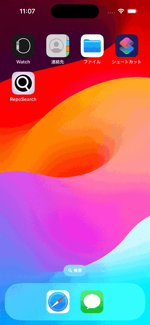

### 新機能１：リポジトリの並び替え

検索画面の右上の設定ボタンから、検索結果のリポジトリの並び順を指定できるようにしました。

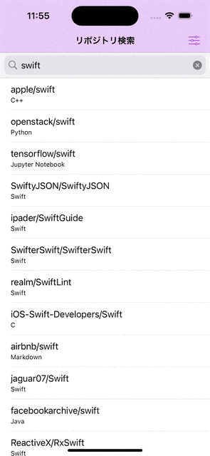

### 新機能２：リポジトリをブラウザで開く

リポジトリの詳細画面の右上のボタンから、そのリポジトリの GitHub のページをブラウザで開けるようにしました。

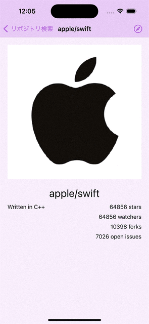

### アプリアイコンの作成
iPad アプリ『アイビスペイントＸ』を用いて、アプリアイコンを作成しました。

GitHub のアイコンをオマージュした黒丸から、検索を意味する虫眼鏡のシルエットを切り抜き、アプリのテーマカラーとして採用した紫色の背景に添えました。

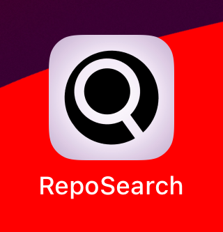

## 設計

### アーキテクチャ

本アプリでは、画面 (ViewController) の複雑さに応じて 2 種類の異なるアーキテクチャを使い分けています。
本アプリで実装している画面は、以下の 3 つです。

1. GitRepositorySearchView ... 検索画面
2. SearchSettingPopoverView ... 設定ボタンのポップオーバーの画面
3. GitRepositoryDetailView ... リポジトリの詳細画面

1 の画面には MVP アーキテクチャ、2, 3 の画面には MVC アーキテクチャを採用しました。

MVP では、プレゼンテーションロジックを ViewController ではなく Presenter に委譲する形で実装を行うため、画面を通じてのユーザーとのやり取りについての関心と、View-Model 間のデータのやり取りについての関心を分離することができ、プレゼンテーションロジックのテストが容易になります。

しかしコード量の増加という欠点も存在することから、簡単な画面では MVC を採用することにしました。

### プロジェクトツリー

ターゲット直下には、画面毎のグループを配置し、View, Presenter, Controller を画面ごとに分けて管理しています。

`Model` グループには、アーキテクチャによる分類上の Model にあたるものが入っています。

`Model/Entity` グループには、API 通信によって取得されるデータの構造体を定義しています。

`Model/Error` グループには、Model のサービスが投げるエラーを定義しています。

`Model/APIQuery` グループには、GitHubAPI との通信に使用するクエリを定義しています。

`Model/Service` グループには、Model が提供するサービスを定義しています。状態は持ちません。

`View` グループには、再利用性が高く特定の画面に属することのない View が入っています。

`Extension` グループには、既存のクラスや構造体に対する extension を記述したファイルが入っています。

## UI をブラッシュアップ

### 彩色

個人的に好きな紫色をテーマにして、UI に色をつけました。

UI に使用する色は、[AppColor.swift](./iOSEngineerCodeCheck/AppColor.swift) という 1 つのファイルの中に、`AppColor.background` や `AppColor.searchBarBarTint` といった文脈化された名前で定義しました。

できる限りシステムで用意されたダイナミックカラーを使用するために、Asset Catalog による管理はしていません。

システムの設定に応じて、ダークモードやハイコントラストにも対応しています。

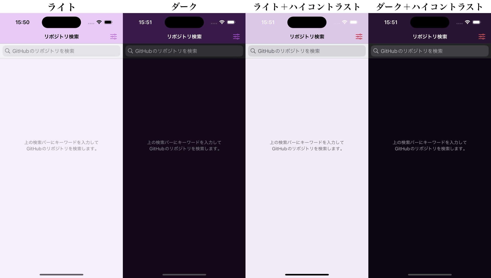

### レイアウト強化

様々な縦横比の画面でも、最適なレイアウトで UI が表示されるようにしました。

以下に、いくつかの例を示します。

iPhone 15 Pro 横画面：

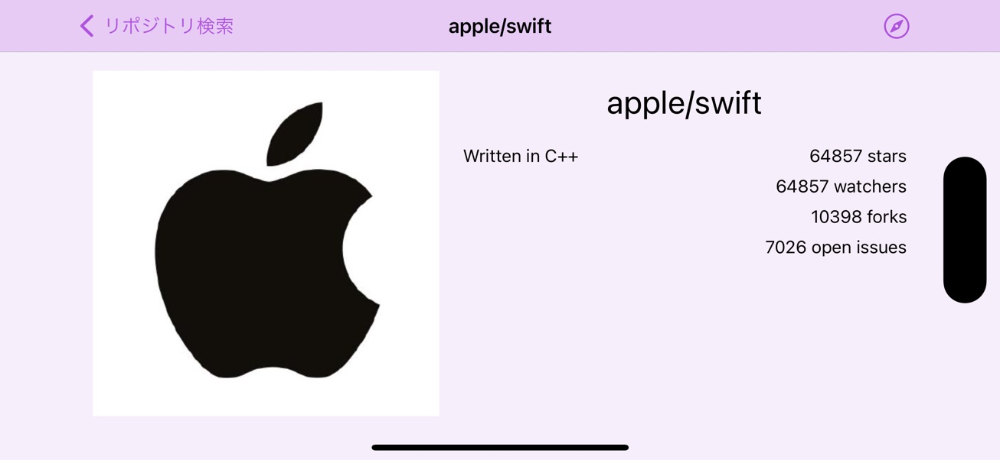

iPad Air (第５世代) 横画面 Split View：

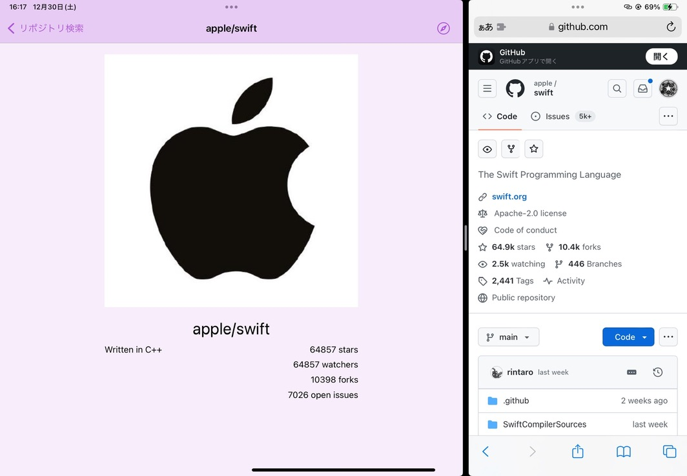

iPad Air (第５世代) 縦画面 Slide Over：

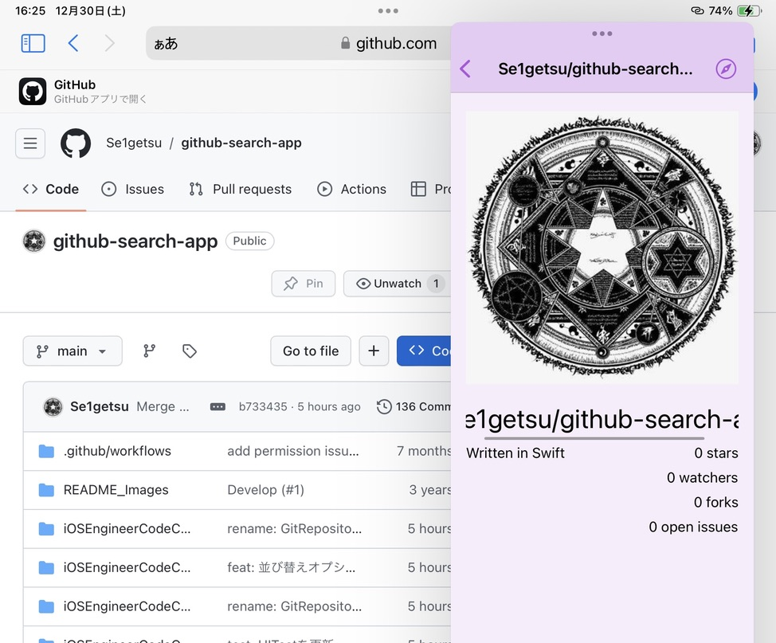

上のようにリポジトリ名が画面幅の関係で表示しきれない場合は、スクロールして見ることができます。

## UXの改善

### 起動直後の案内表示

起動直後に表示される検索画面には何も表示するコンテンツがないため、ユーザーを困惑させないよう、画面上部の検索バーにキーワードを入力することを促す説明を表示するようにしました。

### 読み込み中の表示

HIG に従い、コンテンツの読み込み中には代わりのものを表示し、読み込み中であることをユーザーが分かるようにしました。

まず、リポジトリの検索時には、アクティビティインジケーターを表示するようにしました。

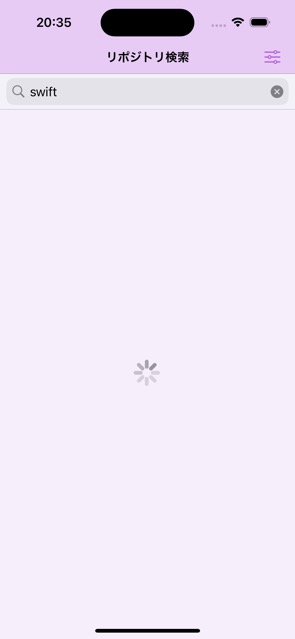

また、画像の読み込み時には、プレースホルダーを表示するようにしました。

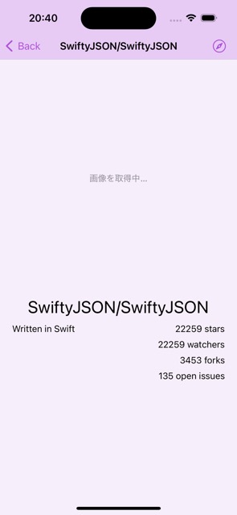

### 検索結果がない場合の表示

検索結果が 0 件の場合は「検索結果なし」の表示をするようにしました。

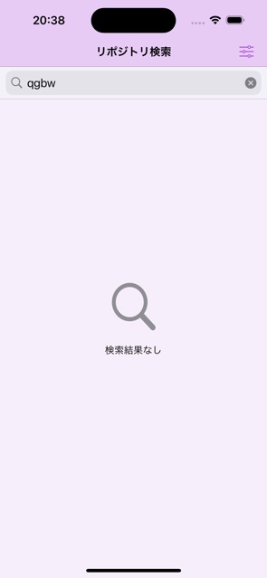

### エラー対処

何らかの原因で読み込みに失敗した場合には、ユーザーにその旨を伝えるようにしました。

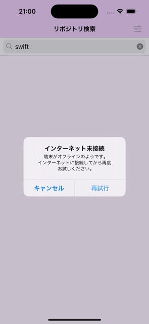

想定外のエラーが発生した場合には、NSError のエラーコードをアラートとして表示し、開発側が解決に取り組む際に最低限問題を分類しやすくしました。

また、リポジトリの画像のフェッチに失敗した場合には、プレースホルダーに「画像の取得に失敗しました」と表示するようにしました。
